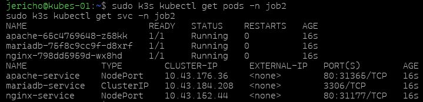
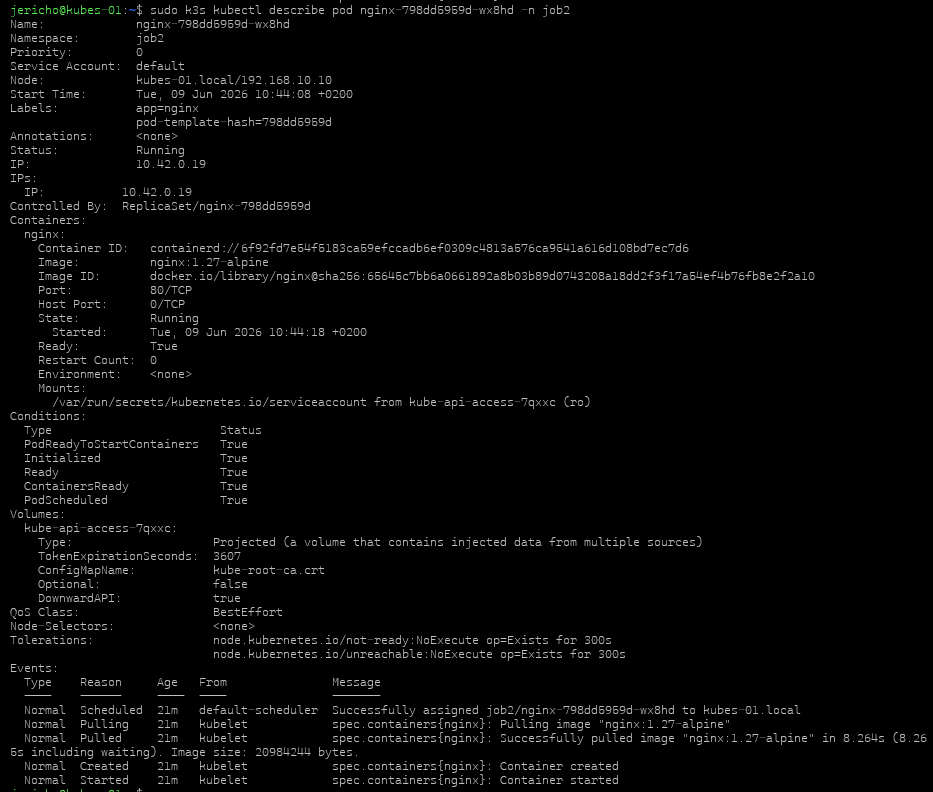
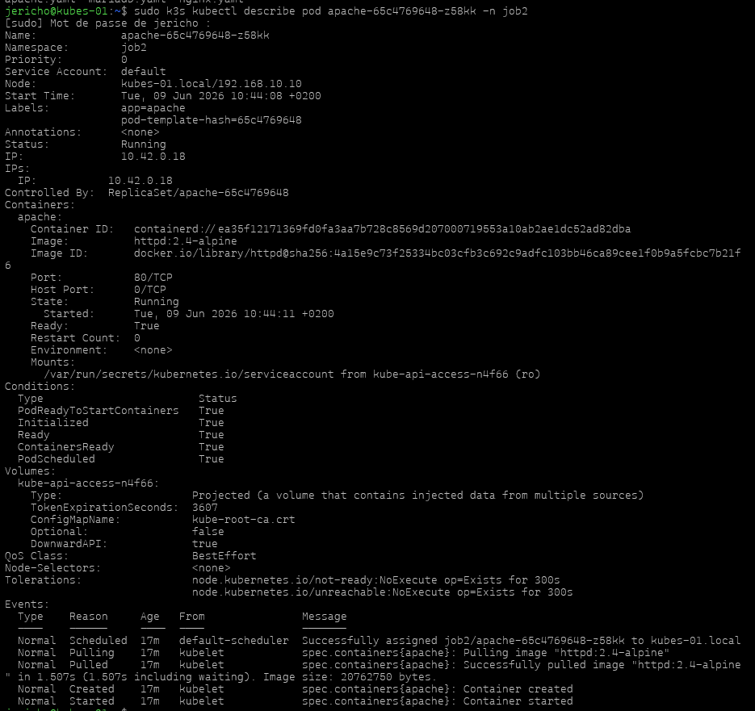
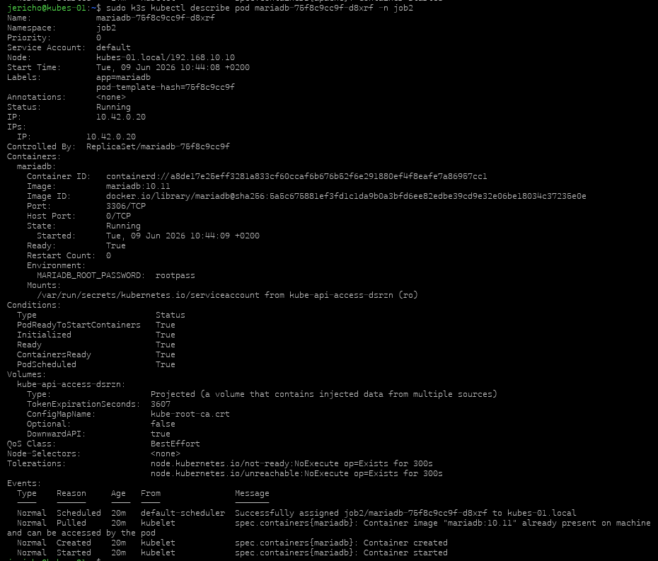
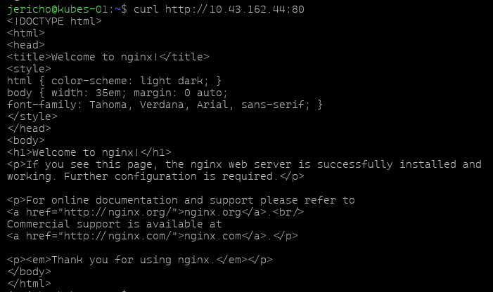
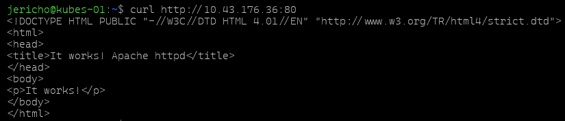

## Objectif
Déployer sur le cluster K3s trois applications conteneurisées :
- nginx
- apache
- mariadb
### Préparation
Vérifier que le cluster répond correctement :
```bash 
sudo k3s kubectl get nodes
```

Créer ensuite un namespace dédié au job : 
```bash 
sudo k3s kubectl create namespace job2 
```

Vérifier sa création :
```bash
sudo k3s kubectl get ns 
```
## Fichiers YAML

### apache.yaml
```yaml
apiVersion: apps/v1
kind: Deployment
metadata:
  name: apache
  namespace: job2
spec:
  replicas: 1
  selector:
    matchLabels:
      app: apache
  template:
    metadata:
      labels:
        app: apache
    spec:
      containers:
        - name: apache
          image: httpd:2.4-alpine
          ports:
            - containerPort: 80
***
apiVersion: v1
kind: Service
metadata:
  name: apache-service
  namespace: job2
spec:
  selector:
    app: apache
  ports:
    - port: 80
      targetPort: 80
  type: NodePort
```

### nginx.yaml
```yaml
apiVersion: apps/v1
kind: Deployment
metadata:
  name: nginx
  namespace: job2
spec:
  replicas: 1
  selector:
    matchLabels:
      app: nginx
  template:
    metadata:
      labels:
        app: nginx
    spec:
      containers:
        - name: nginx
          image: nginx:1.27-alpine
          ports:
            - containerPort: 80
***
apiVersion: v1
kind: Service
metadata:
  name: nginx-service
  namespace: job2
spec:
  selector:
    app: nginx
  ports:
    - port: 80
      targetPort: 80
  type: NodePort
```

### mariadb.yaml
```yaml
apiVersion: apps/v1
kind: Deployment
metadata:
  name: mariadb
  namespace: job2
spec:
  replicas: 1
  selector:
    matchLabels:
      app: mariadb
  template:
    metadata:
      labels:
        app: mariadb
    spec:
      containers:
        - name: mariadb
          image: mariadb:10.11
          ports:
            - containerPort: 3306
          env:
            - name: MARIADB_ROOT_PASSWORD
              value: rootpass
***
apiVersion: v1
kind: Service
metadata:
  name: mariadb-service
  namespace: job2
spec:
  selector:
    app: mariadb
  ports:
    - port: 3306
      targetPort: 3306
  type: ClusterIP
```

## Application des fichiers

Les fichiers sont appliqués depuis le **master** :

```bash
sudo k3s kubectl apply -f nginx.yaml
sudo k3s kubectl apply -f apache.yaml
sudo k3s kubectl apply -f mariadb.yaml
```

## Vérification des ressources

Pour vérifier que les pods et les services sont bien créés :

```bash
sudo k3s kubectl get pods -n job2
sudo k3s kubectl get svc -n job2
sudo k3s kubectl get all -n job2
```

## Vérification des pods

### Nginx
```bash
sudo k3s kubectl describe pod nginx-798dd5959d-wx8hd -n job2
```

### Apache
```bash
sudo k3s kubectl describe pod apache-65c4769648-z58kk -n job2
```

### MariaDB
```bash
sudo k3s kubectl describe pod mariadb-75f8c9cc9f-d8xrf -n job2
```


## Verification Curl
### ngnix :


### apache :


## Résultat attendu

Les trois pods doivent être en état :
- `Running`
- `Ready: True`

Les services doivent également être présents dans le namespace `job2`.

## Captures d’écran à ajouter
- Application des fichiers YAML.
- `kubectl get pods -n job2`.
- `kubectl get svc -n job2`.
- `kubectl describe pod` pour nginx, apache et mariadb.
