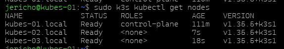
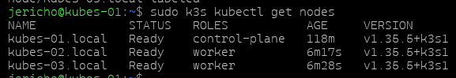
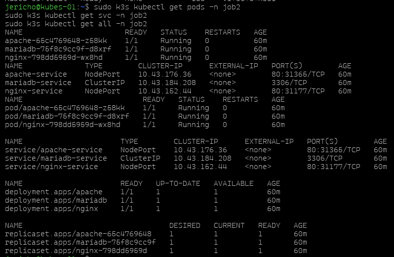

## Objectif
Créer un cluster K3s avec :
- kubes-01.local : master
- kubes-02.local : worker
- kubes-03.local : worker

## 1. Récupérer le token sur le master

Sur `kubes-01.local`, récupérer le token du cluster :

```bash
sudo cat /var/lib/rancher/k3s/server/node-token
```

## 2. Ajouter les workers au cluster

Sur `kubes-02.local` puis sur `kubes-03.local`, lancer la commande suivante en remplaçant `<TOKEN_DU_MASTER>` par le token récupéré sur le master :

```bash
curl -sfL https://get.k3s.io | K3S_URL=https://192.168.10.10:6443 K3S_TOKEN=<TOKEN_DU_MASTER> sh -
```

## 3. Vérifier l’intégration des workers

Retourner sur `kubes-01.local` et vérifier que les nœuds sont bien présents dans le cluster :

```bash
sudo k3s kubectl get nodes
```

Les trois machines doivent apparaître dans la liste :
- kubes-01.local
- kubes-02.local
- kubes-03.local

## 4. changement de nom

Depuis le Master :
```bash
sudo k3s kubectl label node kubes-02.local node-role.kubernetes.io/worker=worker
sudo k3s kubectl label node kubes-03.local node-role.kubernetes.io/worker=worker
```

## 5. Vérifier les applications du job 2

Toujours depuis le master, vérifier que les applications déployées précédemment sont toujours disponibles :

```bash
sudo k3s kubectl get pods -n job2
sudo k3s kubectl get svc -n job2
sudo k3s kubectl get all -n job2
```

## Captures d’écran à ajouter
- Récupération du token sur le master.
- Commande d’ajout des workers.
- Résultat de `kubectl get nodes`.
- Vérification des ressources du namespace `job2`.
