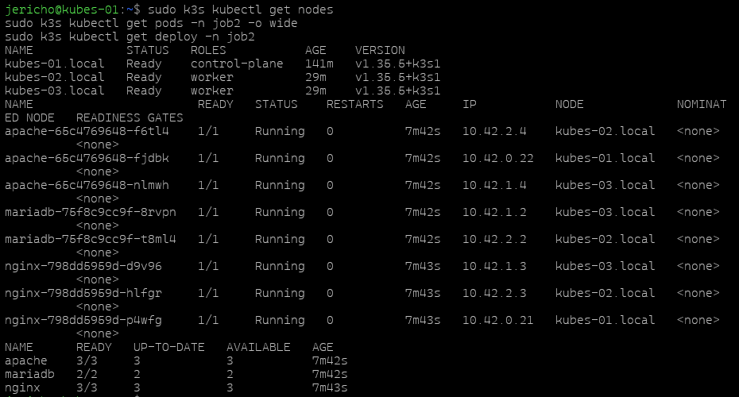
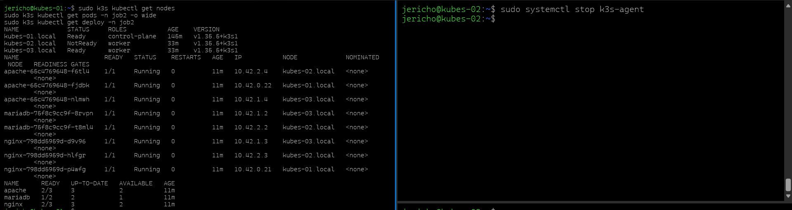

 Le sujet demande de supprimer puis de réinstaller les applications en activant la haute disponibilité avec plusieurs réplicas, puis de tester la reprise en arrêtant un worker.
La manière standard de faire ça dans Kubernetes est de modifier le nombre de réplicas d’un **Deployment** avec `kubectl scale` ou en changeant `.spec.replicas` dans le YAML.

## Objectif du Job 4

Le but est de :

- supprimer les applis actuelles,
- les redéployer avec plusieurs réplicas,
- vérifier que les pods se répartissent sur le cluster,
- arrêter un worker,
- vérifier que les pods sont recréés ailleurs.


## Étape 1 — Supprimer les anciennes applis

Sur le master :

```bash
sudo k3s kubectl delete -f nginx.yaml
sudo k3s kubectl delete -f apache.yaml
sudo k3s kubectl delete -f mariadb.yaml
```

Puis vérifie :

```bash
sudo k3s kubectl get all -n job2
```


## Étape 2 — Réinstaller avec HA

Le plus propre est de repartir avec des `Deployment` qui ont plusieurs réplicas.
Par exemple :

### nginx.yaml

```yaml
apiVersion: apps/v1
kind: Deployment
metadata:
  name: nginx
  namespace: job2
spec:
  replicas: 3
  selector:
    matchLabels:
      app: nginx
  template:
    metadata:
      labels:
        app: nginx
    spec:
      containers:
        - name: nginx
          image: nginx:1.27-alpine
          ports:
            - containerPort: 80
---
apiVersion: v1
kind: Service
metadata:
  name: nginx-service
  namespace: job2
spec:
  selector:
    app: nginx
  ports:
    - port: 80
      targetPort: 80
  type: NodePort
```


### apache.yaml

```yaml
apiVersion: apps/v1
kind: Deployment
metadata:
  name: apache
  namespace: job2
spec:
  replicas: 3
  selector:
    matchLabels:
      app: apache
  template:
    metadata:
      labels:
        app: apache
    spec:
      containers:
        - name: apache
          image: httpd:2.4-alpine
          ports:
            - containerPort: 80
---
apiVersion: v1
kind: Service
metadata:
  name: apache-service
  namespace: job2
spec:
  selector:
    app: apache
  ports:
    - port: 80
      targetPort: 80
  type: NodePort
```


### mariadb.yaml

Pour MariaDB, attention : elle est **stateful** par nature, donc en vrai on lui mettra plus tard un volume persistant.
Pour le Job 4, tu peux garder un replica unique si tu veux rester simple, ou passer à 2 seulement pour le test HA applicatif.

```yaml
apiVersion: apps/v1
kind: Deployment
metadata:
  name: mariadb
  namespace: job2
spec:
  replicas: 2
  selector:
    matchLabels:
      app: mariadb
  template:
    metadata:
      labels:
        app: mariadb
    spec:
      containers:
        - name: mariadb
          image: mariadb:10.11
          ports:
            - containerPort: 3306
          env:
            - name: MARIADB_ROOT_PASSWORD
              value: rootpass
---
apiVersion: v1
kind: Service
metadata:
  name: mariadb-service
  namespace: job2
spec:
  selector:
    app: mariadb
  ports:
    - port: 3306
      targetPort: 3306
  type: ClusterIP
```


## Étape 3 — Appliquer les fichiers

Sur le master :

```bash
sudo k3s kubectl apply -f nginx.yaml
sudo k3s kubectl apply -f apache.yaml
sudo k3s kubectl apply -f mariadb.yaml
```

Puis vérifie :

```bash
sudo k3s kubectl get nodes
sudo k3s kubectl get pods -n job2 -o wide
sudo k3s kubectl get deploy -n job2
```

Le `-o wide` te permet de voir sur quels nœuds les pods tournent.[^2][^5]



## Étape 4 — Test de HA

Maintenant, coupe un worker :

```bash
sudo systemctl stop k3s-agent
```

Fais-le sur `kubes-02.local` ou `kubes-03.local`.

Puis retourne sur le master :

```bash
sudo k3s kubectl get pods -n job2 -o wide
```



Si les réplicas sont bien configurés, Kubernetes doit rescheduler les pods encore disponibles sur les autres nœuds actifs.

## Étape 5 — Vérification attendue

Tu dois constater :

- plusieurs pods pour nginx et apache,
- au moins un pod encore en ligne après l’arrêt d’un worker,
- une redistribution automatique des pods sur les autres nœuds.

