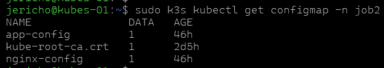
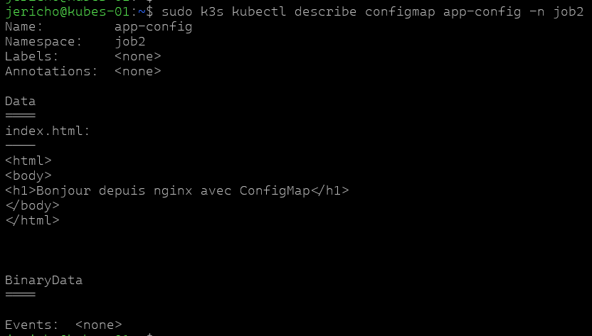
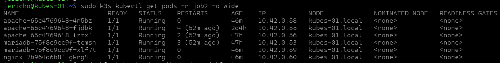
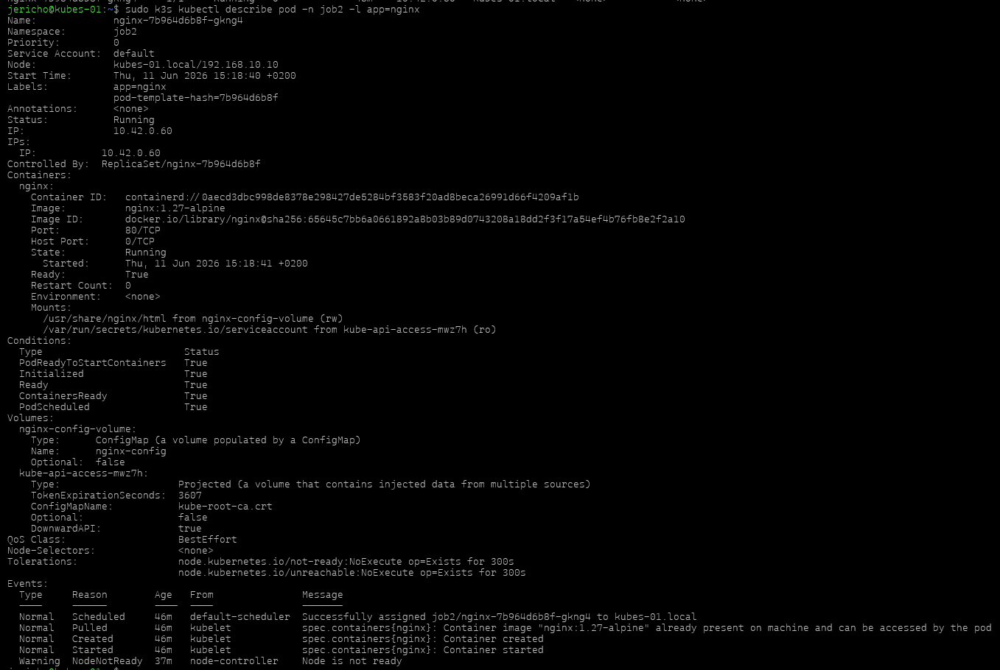

# Job 6 — Configuration des applications avec ConfigMaps

## Objectif

Montrer comment externaliser la configuration d'une application Kubernetes avec une ConfigMap, l'injecter dans un pod et vérifier le bon fonctionnement.

## Commandes

Les commandes utilisées lors de ce job :

`ash
sudo k3s kubectl get configmap -n job2
sudo k3s kubectl describe configmap app-config -n job2
sudo k3s kubectl get pods -n job2 -o wide
sudo k3s kubectl describe pod -n job2 -l app=nginx
`

## Vérification

Vérifier la présence et le contenu de la ConfigMap, et que les pods utilisent bien la configuration :

`ash
sudo k3s kubectl get configmap -n job2
sudo k3s kubectl describe configmap app-config -n job2
sudo k3s kubectl get pods -n job2 -o wide
sudo k3s kubectl describe pod -n job2 -l app=nginx
`

## Screenshots

