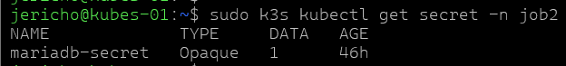
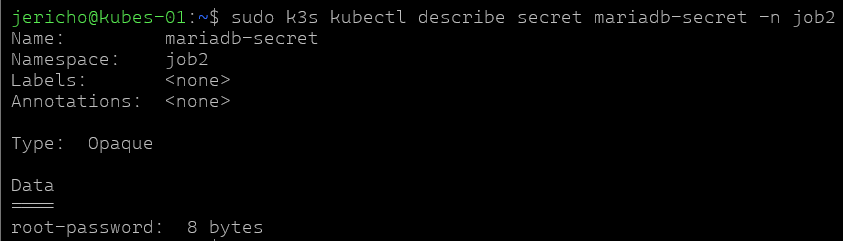
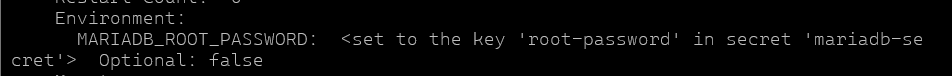
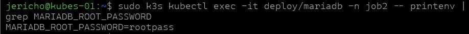

### mariadb.yaml
```yaml
apiVersion: apps/v1
kind: Deployment
metadata:
  name: mariadb
  namespace: job2
spec:
  replicas: 2
  selector:
    matchLabels:
      app: mariadb
  template:
    metadata:
      labels:
        app: mariadb
    spec:
      containers:
        - name: mariadb
          image: mariadb:10.11
          ports:
            - containerPort: 3306
          env:
            - name: MARIADB_ROOT_PASSWORD
              valueFrom:
                secretKeyRef:
                  name: mariadb-secret
                  key: root-password
---
apiVersion: v1
kind: Service
metadata:
  name: mariadb-service
  namespace: job2
spec:
  selector:
    app: mariadb
  ports:
    - port: 3306
      targetPort: 3306
  type: ClusterIP
```

```bash
sudo k3s kubectl get secret -n job2
```

```bash
sudo k3s kubectl describe secret mariadb-secret -n job2
```


```bash
sudo k3s kubectl get deploy mariadb -n job2 -o yaml
```

```bash
sudo k3s kubectl describe pod -n job2 -l app=mariadb
```

Elle prouve que le mot de passe n’est plus stocké en clair dans le manifest, mais injecté depuis le Secret.
```bash
sudo k3s kubectl exec -it deploy/mariadb -n job2 -- printenv | grep MARIADB_ROOT_PASSWORD
```

