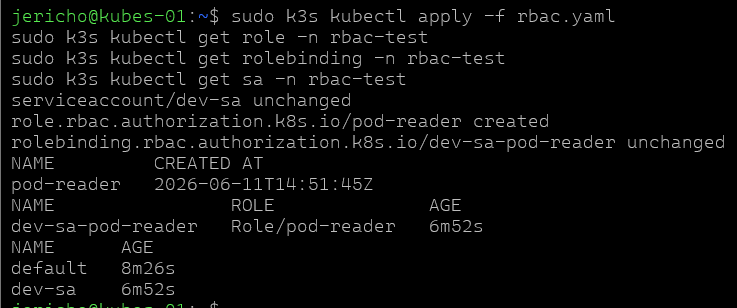
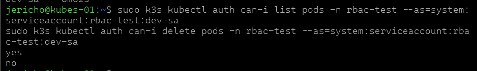

## Ce que fait le RBAC

Le RBAC sert à contrôler l’accès aux ressources selon le rôle de l’utilisateur, et Kubernetes l’implémente avec les objets `Role`, `ClusterRole`, `RoleBinding` et `ClusterRoleBinding`.
Un `Role` s’applique à un namespace, alors qu’un `ClusterRole` peut s’appliquer au cluster entier ou être réutilisé via un binding dans un namespace.
Un `RoleBinding` ou `ClusterRoleBinding` relie ces permissions à un utilisateur, un groupe ou un ServiceAccount.

## Ce qu’on va probablement faire

En pratique, ce job te demandera souvent de :

- créer un rôle avec des permissions précises, par exemple lire des pods ou des secrets
    
- lier ce rôle à un utilisateur ou un ServiceAccount avec un binding.
    
- vérifier avec `kubectl auth can-i` ou en testant des actions concrètes.


## créer le namespace

Si le sujet ne le crée pas déjà, fais un namespace dédié pour les tests, par exemple :
```bash
sudo k3s kubectl create namespace rbac-test
```

## créer le binding
### rbac.yaml
```yaml
apiVersion: v1
kind: ServiceAccount
metadata:
  name: dev-sa
  namespace: rbac-test
---
apiVersion: rbac.authorization.k8s.io/v1
kind: Role
metadata:
  name: pod-reader
  namespace: rbac-test
rules:
- apiGroups: [""]
  resources: ["pods"]
  verbs: ["get", "list", "watch"]
---
apiVersion: rbac.authorization.k8s.io/v1
kind: RoleBinding
metadata:
  name: dev-sa-pod-reader
  namespace: rbac-test
subjects:
- kind: ServiceAccount
  name: dev-sa
  namespace: rbac-test
roleRef:
  kind: Role
  name: pod-reader
  apiGroup: rbac.authorization.k8s.io
```

## appliquer les fichiers
```bash
sudo k3s kubectl apply -f rbac.yaml
```

## Verification :
```bash
sudo k3s kubectl get role -n rbac-test
sudo k3s kubectl get rolebinding -n rbac-test
sudo k3s kubectl get sa -n rbac-test
```



## Test des droits

